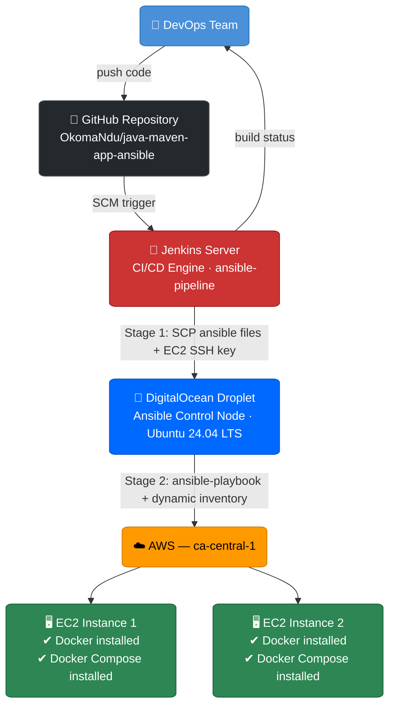

# java-maven-app-ansible

A DevOps project demonstrating end-to-end CI/CD automation for a Java Spring Boot application. Jenkins orchestrates the pipeline, a **DigitalOcean Droplet** serves as the Ansible control node, and Ansible provisions Docker and Docker Compose on **2 AWS EC2 instances** via dynamic inventory.

---

## Table of Contents

1. [What Makes This Configuration Unique](#what-makes-this-configuration-unique)
2. [Architecture Overview](#architecture-overview)
3. [Tech Stack](#tech-stack)
4. [Project Structure](#project-structure)
5. [Prerequisites](#prerequisites)
6. [Step 1 — Provision Infrastructure](#step-1--provision-infrastructure)
7. [Step 2 — Configure Jenkins Credentials](#step-2--configure-jenkins-credentials)
8. [Step 3 — Bootstrap the Ansible Control Node](#step-3--bootstrap-the-ansible-control-node)
9. [Step 4 — Configure Ansible](#step-4--configure-ansible)
10. [Step 5 — Configure the Jenkins Pipeline](#step-5--configure-the-jenkins-pipeline)
11. [Step 6 — Run the Pipeline](#step-6--run-the-pipeline)
12. [Step 7 — Verify Deployment](#step-7--verify-deployment)
13. [Environment Variables Reference](#environment-variables-reference)
13. [Application](#application)

---

## What Makes This Configuration Unique

### 1. Cross-Cloud Orchestration
This setup intentionally spans **two cloud providers**. The Ansible control node runs on a **DigitalOcean Droplet**, while the managed nodes are **AWS EC2 instances**. Jenkins acts as the glue between them — SSHing into DigitalOcean to trigger Ansible, which then reaches across into AWS. This demonstrates that configuration management is not bound to a single cloud ecosystem.

### 2. Jenkins Does Not Run Ansible Directly
Rather than installing Ansible on the Jenkins server itself, Jenkins **delegates execution to a dedicated Ansible control node**. Jenkins SSHs into the DigitalOcean Droplet and runs the playbook from there. This keeps the Jenkins server lean, separates CI concerns from configuration management concerns, and makes the Ansible environment independently reproducible.

### 3. Zero-Touch Dynamic Inventory
There are no hardcoded IP addresses for the EC2 instances anywhere in this project. The `aws_ec2` dynamic inventory plugin queries AWS at runtime to discover instances, grouping them automatically by **tags** and **instance type**. This means adding or replacing EC2 nodes requires no changes to any configuration file — Ansible finds them automatically.

### 4. Architecture-Aware Docker Compose Installation
The playbook does not assume a fixed CPU architecture on the target nodes. It runs `uname -m` on each remote EC2 instance and uses the result to dynamically construct the correct Docker Compose download URL. This makes the playbook compatible with both `x86_64` and `arm64` instances without any manual adjustment.

### 5. Self-Bootstrapping Control Node
The `prepare-ansible-server.sh` script means the DigitalOcean Droplet requires **no manual setup**. A freshly created Droplet is fully prepared by the pipeline itself before the playbook runs — installing Ansible and the `boto3` AWS SDK in one step. The entire control plane can be torn down and recreated with zero manual intervention.

---

## Architecture Overview



---

## Tech Stack

| Layer                 | Technology                          |
|-----------------------|-------------------------------------|
| Application           | Java 17, Spring Boot 3.5.5          |
| Build Tool            | Maven                               |
| CI/CD                 | Jenkins (Declarative Pipeline)      |
| Configuration Management | Ansible                          |
| Ansible Control Node  | DigitalOcean Droplet (Ubuntu)       |
| Target Infrastructure | 2x AWS EC2 instances (ca-central-1) |
| Containerization      | Docker, Docker Compose              |
| Logging               | Logstash / ELK Stack                |

---

## Project Structure

```
java-maven-app-ansible/
├── ansible/
│   ├── ansible.cfg              # Ansible settings (SSH, inventory, plugins)
│   ├── inventory_aws_ec2.yaml   # Dynamic AWS EC2 inventory (aws_ec2 plugin)
│   └── my-playbook.yaml         # Playbook: installs Docker & Docker Compose
├── src/
│   └── main/
│       ├── java/com/example/
│       │   └── Application.java # Spring Boot entry point
│       └── resources/static/
│           └── index.html       # Static welcome page
├── Jenkinsfile                  # Declarative Jenkins pipeline
├── pom.xml                      # Maven project configuration
├── prepare-ansible-server.sh    # Bootstrap script for Ansible control node
└── script.groovy                # Reusable Groovy functions (build, image, deploy)
```

---

## Prerequisites

### Host Machine

The following Python packages must be installed on the host machine using `pip install --user`:

| Package      | Version     |
|--------------|-------------|
| kubernetes   | >= 24.2.0   |
| PyYAML       | >= 3.11     |
| jsonpatch    | latest      |

```bash
pip install --user "kubernetes>=24.2.0" "PyYAML>=3.11" jsonpatch
```

### Jenkins Server

- Jenkins installed and running
- Plugins installed:
  - **SSH Agent Plugin**
  - **SSH Pipeline Steps Plugin**

### Cloud Accounts

- **DigitalOcean** account with a provisioned Droplet (**Ubuntu 24.04 LTS Noble**)
- **AWS** account with:
  - 2 EC2 instances running in `ca-central-1` (Amazon Linux 2, Python 3.9)
  - IAM credentials or an IAM role with EC2 read access (for dynamic inventory)

---

## Step 1 — Provision Infrastructure

### 1.1 Create the DigitalOcean Droplet (Ansible Control Node)

1. Log into DigitalOcean and create a new **Droplet**:
   - OS: **Ubuntu 24.04 LTS (Noble)**
   - Plan: Basic (minimum 1GB RAM)
   - Region: your preferred region
   - Authentication: SSH Key (add your public key)
   - Default user: `root`
2. Note the Droplet's public IP — this becomes your `ANSIBLE_SERVER` value.

### 1.2 Launch 2 AWS EC2 Instances (Managed Nodes)

1. Log into AWS Console and navigate to **EC2 > Instances > Launch Instance**.
2. For each instance:
   - AMI: **Amazon Linux 2** (uses `ec2-user` and `yum`)
   - Instance type: `t2.micro` or larger
   - Region: `ca-central-1`
   - Key pair: create or use an existing key pair (this will be `ec2-server-key-ansible` in Jenkins)
   - Security group: allow inbound SSH (port 22) from the DigitalOcean Droplet IP
3. Launch both instances and note their instance IDs and tags.

---

## Step 2 — Configure Jenkins Credentials

In Jenkins, navigate to **Manage Jenkins > Credentials > System > Global credentials** and add the following:

| Credential ID            | Type                       | Username    | Description                                   |
|--------------------------|----------------------------|-------------|-----------------------------------------------|
| `GitHub-Credentials`     | Username + Password / Token | —          | Access to pull from GitHub repository         |
| `ansible-server-key`     | SSH Username + Private Key  | `root`     | SSH key to access the DigitalOcean Droplet    |
| `ec2-server-key-ansible` | SSH Username + Private Key  | `ec2-user` | SSH key to access the AWS EC2 instances       |

> These credential IDs must match exactly what is referenced in the `Jenkinsfile`.
> The Jenkins pipeline job name used in this project is **`ansible-pipeline`**.

---

## Step 3 — Bootstrap the Ansible Control Node

If the DigitalOcean Droplet is freshly provisioned, install Ansible and its AWS dependencies by running the bootstrap script remotely from Jenkins (handled automatically in Stage 2 of the pipeline), or manually:

```bash
ssh root@<DROPLET_IP> 'bash -s' < prepare-ansible-server.sh
```

The script installs:
- `ansible` — configuration management tool (confirmed version: `9.2.0` on Ubuntu 24.04 Noble)
- `python3-boto3` — AWS SDK required by the `aws_ec2` dynamic inventory plugin (confirmed version: `1.34.46`)

> If already installed, `apt` will skip reinstallation and the pipeline will proceed without error.

---

## Step 4 — Configure Ansible

### 4.1 ansible.cfg

`ansible/ansible.cfg` defines the core Ansible settings:

```ini
[defaults]
host_key_checking = False
inventory = inventory_aws_ec2.yaml
allow_world_readable_tmpfiles = true
enable_plugins = aws_ec2
remote_user = ec2-user
private_key_file = ~/ssh-key.pem
```

- `remote_user`: set to `ec2-user` (standard for Amazon Linux 2)
- `private_key_file`: the EC2 SSH key copied from Jenkins during Stage 1

### 4.2 Dynamic Inventory

`ansible/inventory_aws_ec2.yaml` uses the `aws_ec2` plugin to automatically discover both EC2 instances:

```yaml
plugin: aws_ec2
regions:
  - ca-central-1
keyed_groups:
  - key: tags
    prefix: tag
  - key: instance_type
    prefix: instance_type
```

Ansible groups instances by their AWS tags and instance type, allowing playbooks to target instances selectively by tag.

> AWS credentials must be available on the Droplet via environment variables or `~/.aws/credentials`.

### 4.3 Playbook

`ansible/my-playbook.yaml` runs two plays against all discovered EC2 instances:

**Play 1 — Install Docker:**
- Installs Docker via `yum`
- Starts and enables the Docker daemon via `systemd`

**Play 2 — Install Docker Compose:**
- Creates the Docker CLI plugins directory
- Detects the remote machine architecture (`uname -m`)
- Downloads the matching Docker Compose binary from GitHub releases
- Sets execute permissions

---

## Step 5 — Configure the Jenkins Pipeline

### 5.1 Set the Ansible Server IP

In the `Jenkinsfile`, update the `ANSIBLE_SERVER` environment variable with your DigitalOcean Droplet's public IP:

```groovy
environment {
    ANSIBLE_SERVER = "<YOUR_DROPLET_IP>"
}
```

### 5.2 Create a Jenkins Pipeline Job

1. In Jenkins, click **New Item** > **Pipeline**.
2. Under **Pipeline**, set **Definition** to `Pipeline script from SCM`.
3. Set **SCM** to `Git` and enter your repository URL.
4. Set **Script Path** to `Jenkinsfile`.
5. Save the job.

---

## Step 6 — Run the Pipeline

Trigger the pipeline manually or via a SCM webhook. The pipeline executes two stages:

### Stage 1 — Copy Files to Ansible Server

Jenkins SSHs into the DigitalOcean Droplet and copies all required files:

```
ansible/ansible.cfg          →  /root/ansible.cfg
ansible/inventory_aws_ec2.yaml → /root/inventory_aws_ec2.yaml
ansible/my-playbook.yaml     →  /root/my-playbook.yaml
<ec2-private-key>            →  /root/ssh-key.pem
```

### Stage 2 — Execute Ansible Playbook

Jenkins SSHs into the Droplet and runs:

1. `prepare-ansible-server.sh` — installs Ansible and `boto3` if not already present
2. `ansible-playbook my-playbook.yaml` — provisions both EC2 instances

The playbook targets the following dynamically discovered EC2 hosts (hostnames are assigned by AWS and change on instance restart):

```
ec2-52-60-238-80.ca-central-1.compute.amazonaws.com
ec2-3-99-147-238.ca-central-1.compute.amazonaws.com
```

> **Note:** A Python interpreter discovery warning may appear during `Gathering Facts` for each host. This is expected on Amazon Linux 2 with Python 3.9 and does not affect execution.

### Jenkins Stage View


### Pipeline Stage Timings

The table below shows actual stage durations observed across pipeline runs:

| Stage                        | Average Duration | Notes                                          |
|------------------------------|------------------|------------------------------------------------|
| Declarative: Checkout SCM    | ~443ms           | Git fetch from GitHub                          |
| Copy files to ansible server | ~2s              | SCP of ansible files + SSH key to Droplet      |
| Execute ansible playbook     | ~39s avg         | Varies: ~2min first run, ~14s on repeat runs   |
| **Full pipeline run**        | **~36s**         | Average after initial bootstrapping            |

> **First-run behaviour:** If the DigitalOcean Droplet is freshly provisioned, the `execute ansible playbook` stage will take significantly longer (~2 minutes) while `prepare-ansible-server.sh` installs Ansible and `python3-boto3`. Subsequent runs complete in ~14–15 seconds as packages are already present.

---

## Step 7 — Verify Deployment

SSH into each EC2 instance and confirm Docker and Docker Compose are installed:

```bash
ssh -i <ec2-key.pem> ec2-user@<EC2_INSTANCE_IP>

# Verify Docker
docker --version

# Verify Docker Compose
docker compose version
```

Both commands should return version output, confirming successful provisioning.

### Expected Ansible Play Recap

A successful pipeline run produces the following play recap on both EC2 nodes:

```
PLAY RECAP *********************************************************************
ec2-3-99-147-238.ca-central-1.compute.amazonaws.com  : ok=7  changed=1  unreachable=0  failed=0  skipped=0  rescued=0  ignored=0
ec2-52-60-238-80.ca-central-1.compute.amazonaws.com  : ok=7  changed=1  unreachable=0  failed=0  skipped=0  rescued=0  ignored=0
```

| Metric        | Value | Meaning                                              |
|---------------|-------|------------------------------------------------------|
| `ok`          | 7     | All tasks completed (no changes needed on most)      |
| `changed`     | 1     | Architecture detection (`uname -m`) ran successfully |
| `unreachable` | 0     | Both EC2 instances were reachable via SSH            |
| `failed`      | 0     | No task failures                                     |

**Pipeline status: `Finished: SUCCESS`**

### Build History Summary

| Build | Date        | Commits    | Checkout SCM | Copy Files | Execute Playbook | Result  |
|-------|-------------|------------|--------------|------------|------------------|---------|
| #9    | Apr 16 23:58 | 1 commit  | 425ms        | 2s         | 2min 5s          | SUCCESS |
| #8    | Apr 16 23:52 | 2 commits | 428ms        | 2s         | 15s              | SUCCESS |
| #7    | Apr 16 23:50 | No changes | —           | —          | —                | SKIPPED |
| #6    | Apr 16 23:45 | 1 commit  | 419ms        | 2s         | 14s              | SUCCESS |

> Build #9 took longer on the ansible stage because it was the first run after the Droplet was provisioned, requiring Ansible and `boto3` to be installed. Build #7 had no code changes and did not execute any stages.

---

## Environment Variables Reference

| Variable         | Location    | Description                                  |
|------------------|-------------|----------------------------------------------|
| `ANSIBLE_SERVER` | Jenkinsfile | Public IP of the DigitalOcean Ansible Droplet |

---

## Application

The Java Spring Boot application is a minimal web app used to demonstrate the pipeline:

- Serves a static HTML welcome page at `http://localhost:8080`
- Logs `"Java app started"` on startup
- Version: `1.1.0-SNAPSHOT`

### Build Locally

```bash
mvn package
```

Output: `target/java-maven-app-1.1.0-SNAPSHOT.jar`

```bash
java -jar target/java-maven-app-1.1.0-SNAPSHOT.jar
```
